# Sanad

Sanad carries a doctor's plan after the visit. A doctor sends text, voice notes or prescription photos through Telegram, checks the proposed record and confirms the plan. Sanad turns those instructions into requests with deadlines, helps the patient follow them, collects results and reports, and brings danger, completed requests and unresolved work back to the doctor. The dashboard and patient page show the same saved plan, with evidence and changes kept in context.

## Who it is for

Sanad is for doctors managing follow-up between visits and patients trying to carry out their instructions. Scattered messages make it easy to lose a missing result, an unanswered question or a practical obstacle. Sanad keeps each request visible until its outcome is recorded, while separating receipt of evidence, completion and medical review.

## Architecture



Telegram messages enter an authenticated webhook. The Lambda application saves incoming work before acknowledging it, and workers handle the saved requests. Browser sessions restrict each doctor to their patients; patients see their own plan, and administrators see account applications. An EventBridge minute tick wakes recovery, reminders and unresolved work.

Strands agents on Amazon Bedrock use Nova for bounded reasoning. Gemini reads voice notes and photos. Their output is a proposal: deterministic checks and doctor confirmation control accepted records and instructions. DynamoDB stores records, deadlines and outgoing messages; private S3 stores media. Danger screening has a separate immediate path, and sending rechecks current access, consent and instructions. See the [architecture reference](docs/architecture.md) for details.

## Run locally, offline

Have uv, Python 3.12.14 and the packages in `uv.lock` already available in the local uv cache. A fresh computer needs those prerequisites prepared before going offline. From the repository root, run these two commands:

```sh
UV_OFFLINE=1 uv sync --locked
UV_OFFLINE=1 uv run --offline --no-sync python - <<'PYTHON'
import uvicorn
from pydantic import SecretStr
from sanad.api.app import create_app
from sanad.channels.telegram.settings import TelegramSettings
from sanad.channels.transport import CapturedTransport
from sanad.store.memory import MemoryStore
from sanad.web.settings import WebSettings

app = create_app(
    store=MemoryStore(),
    transport=CapturedTransport(),
    synthetic=True,
    process_receipts=False,
    consent_policy=lambda doctor_id: None,
    telegram_settings=TelegramSettings(
        bot_id="1", bot_token=SecretStr("offline"),
        webhook_secret=SecretStr("offline"), admin_user_id="2",
    ),
    web_settings=WebSettings(
        public_base_url="https://localhost:8000", bot_username="offline_bot",
    ),
)
uvicorn.run(app, host="127.0.0.1", port=8000)
PYTHON
```

Open **http://127.0.0.1:8000/demo**. Its navigation also opens the synthetic patient and administrator views. These pages use separate static fictional records, with no sign-in or cloud connection. The app uses an in-memory store and captures messages locally; the sample settings above connect to no account. Stopping the server discards in-memory state. Interactive Telegram, voice, photo and authenticated account testing uses the separately configured hosted environment.

## Hosted synthetic environment

The hosted synthetic environment is deployed separately, with its own bot, database, media storage and configuration. It is **not deployed yet**. The [testing instructions](docs/judge-instructions.md) describe sign-in, the guided checks and timing labels for that environment. No real patient is enrolled.

## Supported scope

This build supports English doctor text and voice, confirmation cards, printed or typed Latin-script photos, patient enrollment with consent and doctor identity confirmation, and six kinds of care request: medication reports, tests, monitoring, visits, records and tasks. Patient questions have a separate timed reply workflow. Patients can send messages and images, pause or resume reminders and set quiet hours. Doctors can review evidence, answer questions, save reusable answers, choose a question digest time, correct records and amend instructions while retaining history.

Medication follow-up records a reported start and an independent day-three check-in. It does not prove ingestion. Partial results stay incomplete, disputed readings need clarification, and completing a request does not clear its medical review. Practical-help searches can suggest places when configured, with no claim about availability, price or booking. General explanations depend on the approved source set; unavailable explanations are referred to the doctor.

Handwriting, Arabic speech and conversation, Arabic text in photos, generated speech and PDF input are not supported in this build. Sanad does not diagnose, prescribe independently, substitute medication, infer adherence from silence, share patients across doctors, or provide booking, payments, EHR integration, WhatsApp or telephone care. Recurring dose and refill reminders are outside this build.

Development and demonstrations use synthetic patients only. Real-patient activation is closed pending clinical policies, education and consent review, privacy and care-coverage arrangements. Operational tooling includes isolated restore, rollback, health reporting and patient export/deletion, but the live restore and rollback rehearsals and release record are still pending. Nine health measures lack complete instrumentation and four thresholds lack alarms. Synthetic checks do not establish clinical readiness.

## Reuse inventory

Versions below come from [pyproject.toml](pyproject.toml) and [uv.lock](uv.lock). The table includes every direct runtime, development and build library. Dependencies retain their own licenses and notices.

| Library | Version | Use | License |
|---|---|---|---|
| fastapi | 0.141.1 | HTTP application | MIT |
| pydantic | 2.13.5 | Validated data | MIT |
| uvicorn | 0.52.4 | HTTP server | BSD-3-Clause |
| tzdata | 2026.3 | Timezones | Apache-2.0; timezone data public domain |
| boto3 | 1.43.89 | AWS services | Apache-2.0 |
| httpx | 0.28.1 | HTTP clients | BSD-3-Clause |
| strands-agents | 1.54.0 | Bounded reasoning | Apache-2.0 |
| segno | 1.6.6 | Invitation QR images | BSD-3-Clause |
| pillow | 12.3.0 | Image normalization | MIT-CMU |
| pillow-heif | 1.7.0 | HEIF decoding | BSD-3-Clause source; GPLv2 binary wheels |
| pypdfium2 | 5.13.0 | PDF page rendering | BSD-3-Clause, Apache-2.0 (bundled PDFium BSD-3-Clause and permissive third-party notices) |
| arabic-reshaper | 3.0.1 | Text-layout checks | MIT |
| hatchling | 1.32.0 | Package build | MIT |
| mypy | 1.20.2 | Type checks | MIT |
| playwright | 1.60.0 | Browser checks | Apache-2.0 |
| pytest | 9.1.1 | Tests | MIT |
| pytest-socket | 0.8.1 | Offline test isolation | MIT |
| python-bidi | 0.6.11 | Text-layout checks | LGPL-3.0-or-later |
| ruff | 0.16.6 | Lint and formatting | MIT |

pypdfium2 bundles PDFium and its third-party notices for PDF page rendering.

The `pillow-heif` source is BSD-3-Clause. Its binary wheels are declared GPLv2 because of x265 and bundle LGPLv3 libheif and libde265, plus the GPL-3.0-with-GCC-exception MinGW runtime on Windows. Anyone redistributing those wheels must meet their GPLv2 and LGPLv3 source and notice terms. Sanad's MIT code places no extra restriction on that. `python-bidi` is LGPL-3.0-or-later and development-only. The indirect dependencies `certifi` (runtime) and `pathspec` (development and build, through mypy and hatchling) are MPL-2.0.

The [model registry](src/sanad/models/registry.py) contains the following selected and disabled models. Hosted models are accessed through provider APIs; no model weights are bundled or licensed by this repository.

| Model ID | Configuration | License or access terms |
|---|---|---|
| `us.amazon.nova-lite-v1:0` | Selected for reasoning; disabled for photo reading | Proprietary Amazon Nova / Bedrock service terms |
| `us.amazon.nova-micro-v1:0` | Selected for classification | Proprietary Amazon Nova / Bedrock service terms |
| `gemini-3.5-flash-lite` | Selected for independent cross-checks | Proprietary Google Gemini API terms |
| `gemini-3.8-flash` | Selected for voice and photo reading | Proprietary Google Gemini API terms |
| `gemini-2.5-flash` | Disabled | Proprietary Google Gemini API terms |
| `gemini-3-flash-preview` | Disabled | Proprietary Google Gemini API terms |
| `mistral.voxtral-small-24b-2507` | Disabled | Apache-2.0 weights; Bedrock service terms for API access |
| `whisper-large-v3-turbo` | Disabled | MIT weights; hosting service terms for API access |
| `us.amazon.nova-2-lite-v1:0` | Disabled | Proprietary Amazon Nova / Bedrock service terms |
| `mistral.voxtral-mini-3b-2507` | Disabled | Apache-2.0 weights; hosting service terms for API access |

Fonts are self-hosted and retain their SIL Open Font License 1.1 notices.

| Font | License |
|---|---|
| Inter | [SIL OFL-1.1](src/sanad/web/static/inter-OFL.txt) |
| Playfair Display | [SIL OFL-1.1](src/sanad/web/static/playfairdisplay-OFL.txt) |
| Noto Sans Arabic | [SIL OFL-1.1](src/sanad/web/static/notosansarabic-OFL.txt) |
| Noto Naskh Arabic | [SIL OFL-1.1](src/sanad/web/static/notonaskharabic-OFL.txt) |

The diagram renderer uses Mermaid CLI 11.12.0 (MIT). `docs/diagrams/render.sh` needs macOS and an existing Playwright Chromium. Run it to regenerate the SVG.

## License

Sanad's original source is licensed under the [MIT License](LICENSE). Copyright 2026 Sanad contributors. Third-party software, fonts and hosted model services retain the separate terms listed above.
