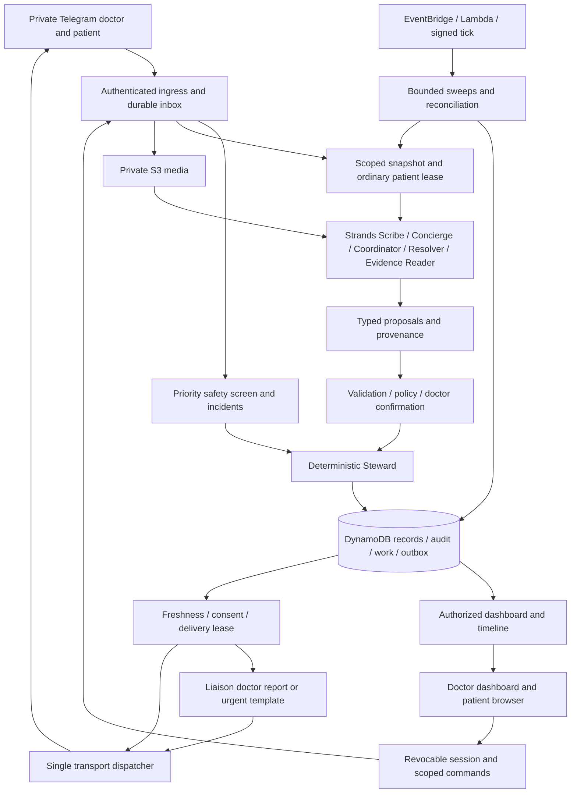

# Sanad Architecture

Version: 2.0 · Reconciled design · 2026-09-05

This is the proposed full-product architecture, not implementation approval. No product code has been written. The hackathon is a delivery milestone and does not authorize removing required capabilities. [domain-model.md](domain-model.md) defines entities, states, clocks and store interfaces. [decisions.md](decisions.md) records product choices. Resolve contradictions before releasing a coding contract.

## System shape

Sanad carries the doctor's confirmed instructions between visits. Agents understand language and propose moves. The deterministic Steward owns identity, clinical boundaries, accepted facts, mission transitions, deadlines and message eligibility. The Liaison owns doctor-facing communication; direct requested answers are distinguished from proactive patient-status reports. A transport adapter alone holds sending credentials.

Patient output passes the Concierge or an approved template and its validator. Agents never send directly. DANGER rendering belongs to the Liaison's deterministic path and never waits for its model.

## Stack and deployment

Python 3.12, FastAPI, Pydantic, Strands Agents SDK, boto3, DynamoDB and private S3. Bedrock supplies reasoning/vision models from the Amazon Nova family (Decision 017); exact IDs and dependency versions are pinned after real access and compatibility checks. Amazon Transcribe and CPU faster-whisper are measured on Egyptian Arabic, mixed drug names and numbers before choosing the voice adapter. Amazon Location Service supplies place search with measured local coverage and a truthful no-result fallback.

One codebase and container image contain the HTTP application and bounded worker handlers. The image runs on AWS Lambda in us-east-1 behind a function URL, the host selected after measurement, and an EventBridge schedule triggers the signed minute tick through a private relay.

EventBridge invokes one tick Lambda every minute, calling authenticated worker routes. Work is persisted before an in-process invocation. A local task can reduce latency but is never the only executor. Worker calls have execution budgets, reclaim expired work and leave remaining pages due for another call. One minute is trigger cadence, not a maximum latency guarantee. Use separate deployment/task/tick permissions, SSM SecureString, TLS, private buckets and usage controls. Browsers never query DynamoDB directly. Uptime, restore, cost and clinical deployment are separate gates. Synthetic and eventual clinical environments are isolated.

## Clinical truth and edits

Versioned current DynamoDB aggregates are authoritative. Every accepted mutation atomically updates aggregates, appends immutable audit events and records owed work/messages. Keep these distinct:

- **Observation:** what arrived, verified source, receipt time and protected payload/media reference.
- **Candidate:** parser/model interpretation with raw/normalized values, spans/regions, uncertainty and validators.
- **ClinicalFact:** typed doctor statement, patient report, document observation or clinician-confirmed information. An accepted patient report remains a report.
- **CareOrder:** structured doctor-approved active instruction and immutable historical versions. Medication name, dose, unit, route, timing and prescribed effective dates are fields, not competing prose.
- **Mission:** finite objective attached to exact order versions, a completion predicate and clocks.
- **ReviewObligation:** independently timed work owned by the doctor; it survives fulfillment, cancellation, opt-out and unsuccessful disposal.

Unknown allergies are not “no allergies.” Old prescriptions do not replace active medications. Confirmed order revisions replace current heads while preserving history. Every candidate and intent carries the versions used. A correction names the exact accepted version it supersedes, invalidates dependent fulfillment if necessary and creates timed review. It never restarts contact or a prescription implicitly. Late new uploads are retained and screened, then explicitly associated or offered as a new mission; they are not corrections by implication.

## Identity and channels

### Doctor approval and dashboard

Only private Bot API messages establish a clinical Telegram identity. Verify transport secret, private chat type and numeric sender user ID; never trust usernames, claimed roles or group chat IDs. A stranger may apply. Configured admin identity approves/rejects with actor and timestamp. Enrollment powers do not grant unrestricted patient-content access.

An approved doctor receives a random, hashed, ten-minute, single-use login exchange in the verified chat. GET `/d/<token>` displays a neutral Continue page; only a same-origin CSRF-protected POST consumes it and creates a rotated HttpOnly/Secure/SameSite session. Redirect to a clean URL. Redact exchange routes in platform/application logs, set a same-origin referrer policy (a no-referrer policy nulls the browser's Origin header on the continue form and the exchange refuses it), no-store, and load no third-party assets. A preview GET cannot consume the token.

Every API, page, callback and media fetch rechecks role, approval, auth epoch and ownership. Mutations also check CSRF, expected version and command ID. Suspension increments auth epoch, revokes exchanges/sessions, invalidates unsent routine contact and creates coverage review. It never transfers patients automatically.

### Patient QR, consent and claim proof

An invitation contains only an opaque random token, stored hashed, scoped to one doctor/patient, expiring by policy and revocable on reissue. No patient name, diagnosis or medication is encoded. Opening it reveals the doctor/service identity and neutral claim instructions only. It does not reveal records or immediately bind a chat.

The intended patient identifies their account in private Telegram, provides a minimal claim identifier and accepts consent/contact preferences. The doctor then confirms through the encounter or an established contact process that this account is the intended patient. QR possession alone is not proof. Persist a pending claim; a second scan cannot overwrite its claimant. The doctor may reject/reset a wrong claim by revoking the invitation.

Consent is offered as a short introduction with Read the full terms, I agree and
I don't agree. Telegram, Amazon and Google Gemini are named explicitly. Opening
the full terms is independent of agreement and sends one plain-text message once
per offer generation. Each claim retains immutable rendered short and full text,
version, language, configuration and SHA-256 digest. Agreement records that exact
offer. A changed current version or rendering requires a fresh offer and new
buttons; accepted claims awaiting doctor confirmation retain their saved terms.
A missing clinic contact refuses invitations and claims. Deferred invitation work
retries after fifteen minutes and yields to a manual invitation without replacing
it. Temporary contact loss refuses agreement without consuming its button.
The authenticated patient page shows the saved agreement date and full terms;
older agreements keep their date and version without reconstructed terms.

Final consumption, approved claim, patient binding and globally unique bot-subject mapping are one transaction. A bot identity may have explicitly authorized admin and doctor roles together. A patient role/binding is exclusive of clinician/admin roles and has one immutable doctor owner. Reject replay, expiry and conflicting bindings without disclosing another record. Claims have review deadlines, so an unscanned QR cannot hide overdue care. Caregiver access and reassignment require a separately approved workflow.

The patient browser uses its own short-lived POST exchange delivered to the verified Telegram account, bound to the active PatientBinding and consent version. An ordinary web request cannot prove a Telegram identity. A browser-first claim remains pending without clinical disclosure until the same consent/doctor-proof gate completes. Revocable patient sessions expose only the released plan and exchanged data, never private doctor notes. Binding recovery freezes disclosure/contact until explicit identity resolution.

## Durable ingress and recovery

1. Authenticate transport and derive scope. Persist an `InboundReceipt` with the permitted normalized payload or immutable protected reference, source media handle, receipt time and processing state before returning 200. Store failure must not be acknowledged as saved.
2. A receipt starts `pending` with `next_action_at`. Duplicates locate it: a completed duplicate does nothing; an unfinished duplicate preserves/resumes existing processing. Existence never means completion.
3. A worker takes an expiring processing claim with increasing generation. Completing work atomically commits domain effects and marks the receipt completed. Crashes/timeouts leave reclaimable work; the inbound sweep retries expired claims. Exhaustion becomes `needs_attention` with timed review/operational ownership, never an invisible dead letter.
4. `MediaWork` separately persists retrieval, protected provider handle, private S3 source and extraction state. Expired downloads ask for resend and remain owned. Never log token-bearing provider file URLs.
5. A `PhotoReceipt` deduplicates bytes only within patient scope and points to media/evidence processing. An incomplete duplicate joins pending work, never pretends that processing succeeded. Each new caption is still screened. Explicit reuse may reference old evidence without claiming newly collected data.
6. Bounded paginated sweeps cover inbound/media, expired claims, missions, FollowUpTasks, ReviewObligations, doctor bundles and outbox. Re-read authoritative state and due time after an eventually consistent index result.

Safe size/duration/type limits bound permitted inputs. Safety sees all permitted text and captions before conversational caps. Unsupported/oversized/unreadable media gets a truthful resend route and timed unresolved work; the system cannot claim to detect an emergency hidden in unprocessed media.

## Ordinary turns and urgent incidents

All ordinary patient workers (replies, doctor changes, association, ticks and resumed sessions) share a per-patient lease and increasing fence generation. Read a versioned scoped snapshot. Model/network work occurs outside transactions. Commit rechecks owner/expiry/fence, safety/delivery epochs, doctor auth epoch, consent, mission/order heads and command authority. A stale worker cannot write over its replacement.

A doctor's new-patient dictation/photo initially belongs to a doctor-scoped IntakeDraft with its own fence; no patient ID or patient consent is fabricated to store that input. Confirmation creates the patient or acquires the chosen existing patient's fence, then atomically associates the accepted material. Unassigned intake is visible only to its owning doctor and has a review clock.

Strands session writes are buffered and committed under the same fence, or enforced by a repository adapter on every write. Unguarded SDK callbacks cannot mutate memory after a lost lease. Instantiate fresh Agent objects per invocation from the scoped persisted session; never share a mutable Agent across concurrent requests.

Unassigned doctor intake uses a doctor-private IntakeConcern and ReviewObligation tied to IntakeDraft, with its own safety_epoch and source dedupe. Danger found before patient association is shown to the submitting doctor through the Liaison gateway without inventing a patient identity or contacting a patient. It bypasses the ordinary intake lease. Doctor-confirmed association explicitly links the concern to the chosen record, creates any necessary patient incident/guidance, and records prior delivery so the same facts do not produce unexplained duplicate alerts. Unresolved unassociated concerns keep independent review clocks.

The urgent path explicitly bypasses the ordinary lease. It screens available text, records an incident with a unique source/rule-family key, increments patient `safety_epoch` and atomically creates review and urgent intents. It does not edit ordinary session/mission state or wait behind transcription. The old safety epoch then prevents conflicting reassurance from committing/sending. Reprocessing the same source deduplicates; later independent dangerous observations are not suppressed by a permanent patient flag.

Approved deterministic patient safety guidance is delivered independently of the doctor's transport/acknowledgment. Doctor alert delivery uses the Liaison. Later verified status may say Telegram accepted the alert, never that the doctor read it or guarantees monitoring. Clinical policy owns severity/applicability; agents cannot invent either.

## Doctor dictation and patient support

### Presentation

Contract 11i releases the catalog and context steps of the language adapter.
The six template render boundaries (doctor wording, contact, Concierge, evidence,
Resolver and Coordinator) resolve a frozen `PresentationContext` containing locale
and audience. Doctor and patient preferences are supplied independently; Decision
023's contest override applies to both. Below a migrated render boundary, catalog
lookup and nested rendering consume that context without reading locale from a
record, environment or global. Existing callers may still supply a language string.

Each surface has an ordinary namespaced, locale-keyed Python catalog. Import-time
validation requires both locales and identical named placeholder sets, and refuses
format specifications, conversions and attribute/index access. Every placeholder
is opaque: the adapter can position its exact text but cannot translate, normalize,
truncate or substitute it, and rendering checks its exact presence. This invariant
starts after accepted wrapper sanitisation, including `untrusted()`; those security
controls and evidence-field rejection remain unchanged. It does not claim raw
caller input always survives sanitisation. Clinical names, instructions, facts,
numbers, instants, identity, provenance and machine vocabulary share this rule.

For each fixed locale, migrated output must match the accepted tuple bytes. Locale
selection is a separate policy. Existing fragments and their composition remain
as released by addendum 1; only newly authored prose must be full sentences. No
new prose is introduced in 11i. The old tuples remain as the equality oracle.
The two dictation renderers, photo layout, legacy monitoring schedule strings,
evidence fingerprints and delivery-time freshness rules are unchanged. Higher
level card, reply, contact and delivery orchestration still takes bare language
strings; a typed CardView and one dictation renderer belong to later contract 11j.

### Grounding

Contract 11g addendum 2 requires code-owned evidence for every printed clinical
field. Evidence identifies the item, field, source, offsets and transformation;
permitted origins are transcript spans, verified vocabulary aliases, authorized
corrections, scoped stored prior orders and deterministic computations. Names
alone do not authorize an action, dose, positive finding or patient experiencer.
An instruction must retain clause scope, negation and change direction. Invalid
or missing evidence becomes clarification and cannot commit through confirmation.
The existing request-omission, numeric and fact-alignment checks remain independent
requirements. Rendering and confirmation recheck evidence; corpus assertions cover
field evidence, required content and forbidden content through confirmation.
Speech normalization retains the raw provider text privately alongside canonical
text and applies numeric separators independently of interface language, preserving
measurement dimensions. This records the released design; acceptance remains with
the architect after implementation verification.

Decision 023 and contract 11e addenda 2–3 select English for new records through
one draft language policy. `/lang en` and `/lang ar` change only the authenticated
doctor's language in a guarded, replay-safe transaction. Speech, extraction and
the saved confirmation card use that language; patient binding takes the doctor's
current default. Arabic prompts, vocabulary and rendering remain available.
Doctor templates, photo labels/buttons and reply wrappers select the current doctor's language at render time; queued captions retain their rendered language, enrollment wording remains bilingual, and clinical fields retain their original content.

The first successful extraction owns history and requested missions. Its peer
checks medication fields, patient identity and TEST analytes without contributing
extra history, missions or free questions. Code folds overlapping primary facts;
oversized cards retain orders and missions and show at most six history lines,
with retained additional history available through Edit. Atomic transaction limits
continue to apply to confirmation.

A spoken medication change retains the explicitly stated previous brand and dose
beside the proposed new instruction. Both identities use the common resolver;
only a source-anchored change within the same seed-defined ingredient family is
combined. Stated previous values are provenance, not an invented prior prescription
date or evidence of adherence. Existing record amendments retain version guards.
Contract 11e addendum 6 drops a bare continue for an identity already carried by a
start, change or stop, including the verified previous identity on a change.
The removal records only a count and removes its current-medication question;
other continues retain the existing reconciliation rules. Incoming correction
indices follow removals and spoken ordering while targets on the previous card
keep their identity.

Supported dictated monitoring requests become MONITOR with a code-compiled
schedule, a card showing the first slot and schedule-derived deadline, and an
every-slot predicate. The 11e TASK compiler remains the fallback for unsupported
metrics and unparsable cadence; its receipt-relative duration behavior is retained.
Old TASK records are not migrated.

Contract 11e consolidates doctor dictation around one deterministic name resolver.
Doctor memory, clinic memory, seed vocabulary, already fetched drug lookup results,
and source-anchored model proposals are considered in that order. Unresolved names
remain in their spoken form. Speech and Scribe hints use these same tables; the
patient plan uses the same resolver. Confirmation learns only displayed vocabulary
through the existing atomic care-plan transaction.

Two fresh Scribe extractions run concurrently against the identical request at
temperature zero, inside the existing fifteen-second extraction budget. Each run
retains its bounded transient retry within that deadline. Code merges their typed
candidates by resolved identity and quantities. Medication, patient and TEST
disagreements retain field-specific code questions. Primary history and missions
are authoritative; secondary-only history, missions and free questions are never
added. A failed primary promotes the surviving reading. Two failures preserve the
existing model-unavailable response. The missing-request guard checks the primary
mission list, including a frequency-bearing monitoring TASK even when a TEST is
present. A missing request uses the primary's remaining single retry with the
identical request, shared lookup cap and original deadline. A failed retry retains
the valid blocked card; a secondary-only request cannot silently authorize work.
Original source numbers and confirmation guards remain authoritative.

The dictation card retains the 11b layout: patient, medications, requested work and
its deadlines, individual history facts, alerts, then short questions. Code chooses
history prefixes and resolves each test analyte separately. Frequency must occur in
the source; unresolved names render plainly with at most one shared explanation.
Single-source provenance adds wording only to an item's existing question.

Dictation admits `finding` and `complaint` facts through extraction
and confirmed storage. Code chooses ECG/Echo prefixes from resolved finding cues,
uses Complaint/Dx for those categories, and retains unknown categories as History.
A fact containing both ECG and Echo/EF cues splits into separate lines at render
time, without changing the stored fact or inferring EF from other words. Dictated
alerts require an explicit source instruction such as "notify me if" or «قوللي لو»;
an observation alone cannot create an alert. This does not change danger screening.
Merge comparisons normalize numeric formatting and patient name tokens; a missing
reading cannot erase the other reading's patient name. Literal source doses remain
the display authority, while unsupported model digits retain their existing blocks.
Placeholder ambiguities and absent timing sentinels are omitted from questions.
Decision 024 and contract 11e addendum 4 require each displayed TEST analyte to
match a transcript token or accepted alias within one edit. An unanchored proposed
analyte is omitted, and its heard fragment is quoted once for correction; the guess
cannot become a confirmed mission or learned name. Authorized corrections retain that resolution
on the same card. Source-named longer brands on change orders require a verified
ingredient family; Echo wording remains as transcribed. Rendered mission counts
and already displayed previous instructions do not create redundant questions.
The measured initial-request budget is under 2,800 tokens for Arabic and under
3,000 for English. The single five-run measurement retries a transport failure
once per run, sharing that allowance across speech and extraction.

Replies while a card is open retain the same patient, unanswered fields, original
thirty-minute expiry and correction guards. Revisions rotate buttons and say
“Card updated from your reply” in English or «عدّلت الكارت حسب كلامك» in Arabic.
Explicit new-patient commands and scoped different-patient
lookup retain their existing escape behavior. Photo extraction and review are
unchanged. The bot AccountScope continues to define clinic vocabulary; lookup
identity exclusion, fixed-host HTTP restrictions, six-request cap, three-second
lookup limit and thirty-day cache remain in force.

After extraction and identity screening, the existing bounded lookup stage fetches
drug-only queries; the pure resolver consumes its results. Undisputed verified
correction readings bypass this fetch. Name-memory writes go through `resolver.learn`.
Merge issues retain their field identity across corrections.

The Scribe accepts text, voice transcription and prescription/history/medication photos. For prescription photos the Evidence Reader independently extracts the same fields; the Steward compares the two candidates and marks disagreements uncertain on the card, where every field stays editable (Decision 018). Code handles explicit commands, then typed proposals for search/create/update/missions. Reads are doctor-scoped; ambiguous patient matches ask. A confirmation shows patient identity, old/new fields, active order changes, objectives, predicates and exact deadlines with reasons. It references base versions, expiry and a one-use nonce.

Missing deadlines are inferred from task-specific approved defaults and contextual proposals, shown on the existing confirmation card. An explicit valid time survives exactly, including hours. The reconciled default notification grace is **zero**; only an explicit visible doctor policy adds grace, showing `escalation_at = due_at + grace`. Inference cannot invent drug, dose, treatment duration, preparation or other absent clinical content. Necessary ambiguity asks; independent valid items can be confirmed separately. Incomplete drafts and awaiting-link care retain review times without authority to send incomplete treatment instructions.

### Patient conversation

Patient handling runs deterministic safety, bounded add-only safety voting, treatment-change gate and code intents before Concierge. Concierge explains the active plan, gives bounded general education from the scoped reviewed sources, asks clarification or creates a QUESTION support ticket. Every generated patient sentence passes output validation and bounded reassurance checks; failure yields a safe template/relay. Education is required with a small owned source/evaluation set, not an unwritten prerequisite library.

Contract 15 adds deterministic visit and task branches after the existing authority, preference and voice-number gates. Selection uses only this patient's active missions. A patient transaction saves the original report, any window or fulfilment revision, audit, DONE/reply intents and receipt together. Selection callbacks retain the original report's receipt time and enforce current mission versions and authority epochs. Booking, attendance and document receipt remain separate predicates. The contact scheduler renders visit briefs from current same-patient requests, keyed by mission and deadline generation; unsupported tasks retain accountability without a patient chase.

Contract 10 implementation boundary: patient-initiated replies require the active clinical consent and binding, including when routine contact is stopped or snoozed. Routine permission and pause expiry are separate operational fields; preference transactions keep Patient, Consent, PatientBinding and PatientProfile versions coherent and increment delivery_epoch. A scoped patient-turn transaction commits reports/preferences/questions, audit, validated reply and receipt completion together. START reports use the existing objective transition and independently anchor the existing day-three task; raw ordinary replies keep their existing non-fulfilling meaning. Concierge session snapshots contain only the last six accepted conversation messages and remain disposable, fenced memory.

Education is a versioned set of bounded excerpts. Clinical entries cite fetched public health sources; the emergency entry takes its actionable wording exclusively from the safety policy. Product-specific QR and photo instructions cite their local Sanad specification separately from the public NHS background source, so no public body is credited with describing Sanad. Pending translations are synthetic-only. Model-selected sentences must match the bundle's permitted plan or education sentences, in addition to the existing clinical, language, numeric, source and length gates; the model cannot invent a new drug-number association.

Coordinator chooses guarded mission proposals. Resolver addresses practical barriers within a question/search budget. They can propose contact times or verified places, but cannot change clinical deadlines, book without an authorized integration, invent availability/prices or prescribe substitutes. Provider failure uses the deterministic ladder with visible failure state. Both remain required capabilities.

Contract 16a implements barrier routing and the Resolver separately from 16b's
Coordinator. Its replaceable places adapter uses OpenStreetMap Nominatim and
Overpass, superseding the earlier proposed Amazon Location provider. Only an
area stated in the current barrier conversation enters the lookup. A typed
attempt on the mission retains patient words, outcomes and cached places.
Receipt-preserving fenced checkpoints reserve reasoning and tool budgets before
external work; recovery cannot repeat spent reasoning or reset an attempt.
Unresolved attempts retain the original clinical deadline and barrier pause.
Contract 16b narrows Coordinator contact proposals to wording only: the accepted
scheduler first prepares the unchanged contact and its exact slot/window. One
bounded Coordinator turn selects a move and ordered fact identifiers from a
code-built mission bundle. A separate fenced Steward audit checkpoint consumes
the one attempt before the call; recovery of that checkpoint uses the template
without another call. The unchanged source clock remains the recovery path.
The Steward persists the version-bound selection and
refusal audit with the original contact transaction; failed selection retains the
existing template. Delivery renders from current patient language and rechecks
the saved facts through the output validator and safety kernel. Monitoring uses
its existing scheduled slots, never a new chase. Single-choice medication and
pre-visit brief contacts keep their accepted templates without a model call.
Pause, completion, barriers and any adjustment to contact time confer no new
Coordinator authority. All policy numbers and wording remain owner-review pending.

Patient conversation includes deterministic medication start, stop, change and date handling before the general Concierge fallback. Problem meaning comes from two independent typed resolver proposals through the worker registry, replacing phrase classification; code verifies both patient quotes, polarity, experiencer and single-target evidence before choosing existing help. After the existing safety, treatment-change, preference and identity/question gates, a day-three answer takes precedence over STOP, CHANGE and START acknowledgments; an unambiguous combined stop/start report records both in one transaction. The stopped current order is available solely for STOP acknowledgment, separately from the active plan projection. Choice callbacks retain the screened text and exact target version. No model chooses an acknowledgment, date anchor or mutation. A receipt-claim-fenced reservation precedes the concurrent readers under the existing extraction deadline, with one call retry per reader and one separate crash recovery attempt. The accepted, none, uncertain or failure outcome commits atomically with its action and is revalidated against the screened receipt text or transcript. Replays reuse that outcome. Telegram callbacks and web text choices bind the receipt, target version, 30-minute expiry and single use; explicit categories retain patient_choice provenance.

Medication amendment confirmation uses the existing pure transitions to supersede prior unfinished missions, cancel their day-three tasks and resolve their unmet-objective reviews atomically. Scoped outbox cleanup follows on an ordinary Steward command or sweep, with the existing active-order send check also applied before delivery attempt admission so stale source versions cannot obscure the `order_inactive` refusal. The patient store admits only clarification metadata changes, exact barrier projections and justified order-scoped suppression; existing identity, consent, lease and receipt guards still apply.
### Doctor questions

`AnswerQuestion`, `AcceptTask` and `ReopenTask` use the accepted doctor two-step boundary: an idempotent, fenced PatientScope command atomically commits clinical effects, review resolution, audit and outbound intents; a replay-safe TenantScope `ScribeReply` then completes the doctor receipt. Recovery recovers the committed clinical target before considering a newer or expired listing. The listing token, patient/ticket pairs, expiry and sequence live on the doctor's saved listing reply in the private Scribe intake conversation; no patient session or global clinical lookup is introduced. Task actions consume a stable per-card immutable audit key because delivered outbox records cannot be rewritten.

Treatment-changing answers are retained only on the doctor's question record. A real Scribe amendment confirmation sets durable readiness and its accepted order-version reference; a tick uses the ordinary answer command to resolve the question and send the fixed plan-update notice. The held sentence is never transmitted, paraphrased or validated for delivery. Terminal answer/closure consumes the held answer, so reopening does not replay its old amendment. Question extension moves the independent answer-review clock, and cancellation is refused while that review is unresolved. Patient output and delivery authority are checked independently of clinical completion.

## Fulfillment, evidence and clocks

### Monitoring

Contract 13 compiles supported repeated vital requests into confirmed MONITOR
schedules. New plans retain timezone, cadence and the window-next-v1 rule:
assign once to the observed window's empty slot, else its empty successor, else
extra. Legacy plans retain nearest-slot replacement within three hours. Restores
use current assignments; value-only corrections retain their slot. Cards store
the displayed instants and refuse changed schedules before evidence validation,
after the existing instruction-fact and authentication guards. Coverage counts
distinct filled slots only.
Patients may change only the reading times on eligible window-next-v1 plans,
starting the next local day, after a version-bound, single-use confirmation.
RescheduleMonitorTimes atomically replaces unfilled future instants at stable
indices, appends effective-dated history, suppresses moved-slot queued prompts,
rebinds unchanged queued prompts and primes the existing scheduler. Recorded
readings, count, duration, explicit dates and clinical deadlines stay fixed.
The store reconstructs the complete write set from the saved offer. Consent,
binding and browser sessions do not advance; replacement slot identities require
fresh quiet-hours grants. The doctor sees the history on the plan, without a push.
The existing safety screen runs first. Text facts and photo acceptance share
the same slot predicate and atomic Steward transaction, including fulfillment
and independent result review. Immutable source references retain values and
threshold provenance. Code renders missing slots, values and descriptive trends
on the existing DONE/DEADLINE gateway. Draft schedule policy remains pending
owner review; no model supplies schedule arithmetic or patient wording.

PDF documents use the same independent visual readers and evidence predicates as
photos. A PDF contains at most ten pages and remains one report. Sanad stores the
original privately, renders pages in isolated bounded processes, and checkpoints
each page separately. Corroborated danger is handled immediately after each page;
a missing, unreadable or conflicting page blocks the report for review. The doctor
can inspect numbered page images and download the original through the same
session and patient authorization. No PDF text layer supplies clinical evidence.

Decision 023 supports printed or typed Latin-script documents; handwriting and
Arabic script in images remain unsupported. Contract 11d normalizes document
uploads and channel photos through one image path before reading: bounded Pillow/HEIF decode, EXIF orientation, grayscale,
autocontrast (cutoff 1), up to 2x Lanczos enlargement (2600-pixel enlargement
ceiling; larger delivered pages keep their dimensions), and JPEG quality 85.
The original and the exact normalized reader input remain separate private
objects linked by MediaWork. Nova Lite and Pro read concurrently with their
existing per-call timeout and one JSON-only retry each. A failed reader stays
explicitly failed. An editable card requires two successful readers and name
agreement on at least `ceil(max(first row count, second row count) / 2)` rows.
Agreement uses the attempt-3 scorer's NFKC/case/punctuation normalization and
Levenshtein distance of at most two, with maximum one-to-one row matching.
Blank/unreadable names cannot agree; empty documents remain unreadable. Below
this threshold the reads stay private and the honest fallback adds
«قريت الورقة قراءتين مختلفتين، مش هسجّل منها حاجة»;
one survivor is retained privately and receives only the honest fallback plus
«قريت الورقة قراءة واحدة بس، مش هسجّل منها حاجة», with no proposal or buttons.
It cannot raise a document-derived incident by corroborating itself. This gate
also applies to cached reads, association rereads and older proposals at
rendering, button generation and confirmation. Existing disagreements, number
checks and shifted-row blocks remain on cards that pass the gate. Two failed
readers also select the honest fallback. On fallback documents, danger requires
a critical row readable by both successful readers.

The Arabic document-output allow-list starts empty. Arabic-bearing fields are
nulled before clinical grading and candidate creation, with code-owned
`arabic_dropped` field metadata. No vision vocabulary hint or transcription
intermediate is used. For prescription rows with dropped Arabic, Pillow crops
the instruction column using page/layout fractions and horizontal ink bands.
That private crop is linked to the read and queued atomically after the card,
with the same proposal/doctor freshness checks and ordered delivery. Telegram
sends its bytes as a photo; Arabic instructions are never prefilled. These
are engineering controls, not Arabic OCR or clinical validation.

Contract 12 routes bound patient photos through the existing durable media work
and two independent document readers. The saved read is reused after a crash.
A private, receipt-scoped first-write-wins read checkpoint is written before the
content-addressed read is linked to MediaWork, so a crash in that gap reuses the
completed reader pair. No clinical acceptance follows from that checkpoint.
Code classifies one document per photo and screens both readers' rows, including
active doctor-defined value alerts, before duplicate or association decisions.
Printed names are association hints only. A deterministic evaluator checks the
confirmed mission's category, units, dates, completeness and document count;
ambiguous choices and task evidence require the specified patient or doctor
action. The Steward alone appends immutable evidence versions and advances
their heads, atomically with any objective transition, review and outgoing
intent. Before fulfillment, code removes noncontributing or redundant accepted
receipts in latest-first order while the pure predicate remains satisfied, so
only the required completing set supplies receipt timing and evidence references. Historical prescriptions never enter the order compiler. A pending
on-time receipt changes the deadline wording without moving its clock; later
verification retains the original deadline and records its updated disposition.
Alerts add to the unchanged safety floor and use code-rendered current orders,
conditions and previous dated measurements as doctor-only context. The existing
doctor photo controller is extended at its caller through an evidence safety
adapter; the shared reader and grading helpers remain imported, unchanged.

Contract 12 binding addenda 2–3 apply Decision 023: contest photo support is
printed or typed Latin-script documents, one paper per photo. Handwriting and
Arabic images are declared upgrades. Identity is match, mismatch or unverifiable;
only agreeing readable Latin names can establish a mismatch. Empty, conflicting,
non-Latin or clinic/lab header hints remain unverifiable, without guessed
transliteration. Empty and absent units compare as the same missing observation.
An associated unverifiable paper is retained as `accepted_pending_identity`.
The pure predicate still runs, but every required paper needs its own doctor's
identity confirmation before the existing atomic fulfillment transaction runs.
The evidence review card and session API offer confirm/reject; rejection detaches
the pre-fulfillment evidence and asks the patient the existing name question.
Danger is screened first and its independent review survives either choice.
The unchanged deadline uses pending-verification wording while identity waits;
confirmation retains receipt-based timeliness and the deadline-disposition audit.
All evidence wording and buttons select the recipient's English or Arabic pair.
Post-fulfillment rejection remains guarded for slice 19.

Mission execution and clinical review are separate. `fulfilled` means the explicit objective predicate is met; `DONE` is a message class, not clinical clearance or a state name. Old `pending_review` becomes a derived review status of fulfilled work. Unsuccessful disposal is `closed_unfulfilled`, never fulfillment. See the exact [state/event contract](domain-model.md#mission-state-and-event-contract).

TEST checks identity, ordered analytes, units and collection window; permitted partial reports may jointly satisfy coverage. Ambiguous identity/units remain candidates. Every route, including mismatched/unexpected documents, evaluates supported danger rules and can create an unverified incident without accepting data onto the wrong record. SEND_RECORDS defines categories, historical period and count/completeness: old dates are valid, unrelated readable files are not. It never silently fulfills a new TEST. MONITOR assigns readings to explicit slots and preserves missing/duplicate/late distinctions and threshold hits. Receipt/collection and extraction times differ. Domain-model defines objective_received_at and timeliness separately from fulfilled_at. Pending extraction at the deadline is reported as verification pending, not a fabricated patient-late submission; receipt alone still cannot prove completeness.

Doctor confirmation of a START instruction creates an independent `MEDICATION_DAY3` FollowUpTask immediately, awaiting its effective-start anchor if unknown. Medication START acknowledgment fulfills only the start-report objective, labeled patient report, and anchors/preserves that existing follow-up. An explicit doctor date can anchor it at confirmation. STOP/CHANGE acknowledgments do not automatically create a new day-three task; a doctor-requested follow-up uses an explicit CLINICAL_CHECKIN. Plan confirmation is never proof the patient started. Unknown anchors remain timed clarification work; once known, the independent task remains scheduled after START fulfillment. Its question, response, silence, red flags and deadline are persisted separately. A valid answer to the check-in fulfills the FollowUpTask and produces its own DONE notice, so a START order yields two DONE notices, one at the start report and one at the answered day-three check-in (Decision 012). STOP/CHANGE orders have their own exact predicates. Recurring dose reminders are owner-agreed later scope; full v1 includes start acknowledgment and day-three follow-up. Opt-out/order stop suppresses routine contact but retains timed disposition of unfinished follow-up.

Every mission stores due time/provenance, visible grace, review time and next action; pauses also have resume time. ReviewObligations and FollowUpTasks have independent clocks. A doctor BundleSchedule owns weekly reminders. Fulfillment/cancellation clears only mission execution wakes, never these independent clocks.

Tick processes accountability before contact eligibility: unmet deadlines, unlinked patients, review, incidents and bundles survive contact pause/stop. Three budgets distinguish daily patient-wide chase, consented scheduled monitoring/check-in slots and urgent messaging. Scheduled slots preserve clinical timing and require explicit quiet-hour exceptions. Never shift a prescription or burst stale reminders after an outage.

Contract 11 adds a deterministic contact scheduler after the existing mission/follow-up accountability wake. Confirmation and binding retain an immediate discovery clock; the scheduler records future contact times or atomically emits patient routine intents through `ContactScheduled` / `PromptScheduled`. Chases use the patient's local day, quiet hours and pause floor; MONITOR and day-three prompts keep their original clinical slots and bounded send windows. Expired windows receive code-only audit. Persisted first/last accepted chase times support the ladder across restarts. Only provider acceptance applies idempotent contact feedback through the Steward; accepted intents retain a delivery recovery clock until feedback is recorded. Scheduled contacts use their own slots and do not exhaust the chase budget. STOP/CHANGE acknowledgment missions and QUESTION work receive no chase. Expired patient pauses and reply-based reachability are code-rendered projections in the guarded scheduling transaction.

The same delivery gateway stamps a DEADLINE obligation's first provider acceptance and arms its doctor's `BundleSchedule` atomically with delivery completion. A doctor-scoped bundle intent references that schedule's generation; it re-reads unresolved, sufficiently old obligations and renders bounded bilingual template lines immediately before transport. Accepted delivery advances the weekly generation and clock; uncertainty retains timed disposition without advancing the interval. Bundle eligibility and delivery never require patient routine consent. Contact policy numbers and all new wording remain pending owner review. Bundle delivery uncertainty retains an independent, doctor-scoped delivery-failure review and does not advance acceptance cadence or resend automatically. Empty or authority-suppressed generations may be retired so a later eligible first notice is not blocked by an old logical key.

## Doctor communication and review

Steward classifies DANGER, DONE and DEADLINE according to recorded policy. Liaison composes from a versioned facts bundle, with templates if its model is down. All doctor interactions share that presentation owner; requested registration/lookup/confirmation replies remain outside the proactive filter.

DANGER is immediate. A critical observation that also fulfills a task produces one urgent report carrying both facts, not redundant DONE. DONE announces verified/report-qualified fulfillment of a mission or a FollowUpTask before clinical review. DEADLINE carries unmet deadlines, due support/review or the approved pre-visit subtype. Routine progress/barriers remain on the dashboard unless requested.

The reconciled correction proposal is an updated-DONE report referencing an already delivered report and its explicitly accepted correcting version. It states that the prior report changed, including invalidated fulfillment, and requests review; it never pretends the objective was fulfilled again. A qualifying danger uses DANGER instead. This subtype is a design proposal for final audit, not evidence of new owner approval.

Each incident/evidence version/disposition has one active ReviewObligation per kind, deduplicated by source key. States are `open | acknowledged | resolved`; “seen” is not resolution. Review/Answer/Extend/Close/Cancel resolves only obligations whose conditions that action satisfies. Cancelling a mission does not dismiss a dangerous result. Review survives terminal execution, opt-out and failed delivery.

After an initial DEADLINE notice, unresolved cards enter one doctor-wide bundle after seven days and weekly thereafter; no daily per-item nagging. Material changes supply a versioned new notification reason. Incident coverage has its own urgent policy; a weekly ordinary bundle cannot replace urgent response. Suspended coverage creates operational review without automatically disclosing clinical content to an unapproved admin.

## Outbox and delivery

A domain commit includes audit, next-work state and outbound intents in one DynamoDB transaction. Sending is outside it. Each intent's logical key uses source event/version, audience, purpose and slot; attempt numbers belong to DeliveryAttempt, not that logical key.

Before sending, a dispatcher claims an expiring delivery lease and checks the applicable account/intake/patient audience variant in domain-model: current recipient authority, source versions, expiry and relevant epochs/orders. Patient routine messages require current binding/consent; valid doctor accountability does not depend on the patient remaining opted in or linked. Intake alerts require doctor/intake authority, not an invented patient binding. Eligibility is purpose-specific: DONE:FULFILLMENT requires currently valid fulfillment; proposed DONE:CORRECTION requires a previously delivered report plus its current accepted correcting version and may send while fulfillment is invalidated_pending_review. It explicitly corrects the earlier conclusion and never announces new completion. Other current authority checks still apply. Invalid routine intents become `suppressed` with reasons, including old queued output. Chase reservation is atomic; refund only a provably unsent attempt, never an uncertain one.

Delivery states are `queued → sending → provider_accepted | uncertain | failed`, plus `suppressed`. Acceptance stores Telegram message ID. Doctor acknowledgment is a separate review/card event. Retryable failure retains bounded attempts/retry time; permanent blocked-chat errors create disposition work. Uncertain DANGER may be resent once, labeled the same incident. Ordinary uncertain delivery waits for timed review. Neither is assumed successful.

A dispatch-start transaction revalidates freshness and records a network attempt. An edit/opt-out invalidates unsent intents but cannot recall an already-started external request. Record the race. If an old instruction may have reached the patient, send the new doctor-approved correction through the patient channel and create timed review. Never promise exactly-once delivery or instantaneous recall across a network boundary.

## Interfaces and implementation boundaries

Commands include ApproveDoctor, SuspendDoctor, ConfirmPatientClaim, ConfirmProposal, ReviseOrder, RecordEvidence, CorrectEvidence, ExtendMission, ReopenMission, CancelMission, CloseUnfulfilledMission, AcknowledgeReview, ResolveReview and SetContactPreference. Each carries Principal, idempotency key, expected versions and typed payload. Return accepted, stale, forbidden, unsupported or needs-confirmation explicitly.

HTTP families: POST `/tg`; authenticated `/internal/tick`, work and delivery; GET/POST doctor/patient exchanges; `/d`, `/p`, `/a`; scoped `/api/*` and media; `/health`. Internal calls validate service identity/HMAC, timestamp and persisted nonce replay protection. Browser writes use session+CSRF. Telegram callbacks are opaque references with actor/version/expiry checks.

Strands uses a BedrockModel factory, fresh Agents, structured outputs, scoped @tool functions, BeforeToolCallEvent cancellation plus in-body guards, fenced RepositorySessionManager, bounded async calls and metadata-only traces. Agents propose; Steward commits. Tools cannot select tenants, obtain secrets, call arbitrary URLs or change policy. The spike verifies actual SDK behavior before it is claimed.

Failures preserve input and owed work. Database outages cannot receive a saved ACK; model/schema failures cannot change clinical truth; unreadable media stays timed; conflicts re-read. Every unresolved item has an owner, action and time. Reconciliation repairs missing derived work without manufacturing success.

Contracts 00–21 deliver the full product: typed foundation; state/deadlines; store/recovery; safety/identity/deployment/Strands; complete care flow; corrections; integration and operational/pilot readiness. Contract 22 packages the contest entry. No product code starts before the final architecture audit and release of a bounded contract.

A patient start report received after routine contact is stopped still records the report and the independent day-three anchor. The follow-up remains contact-suppressed, with its disposition review intact; anchoring does not renew contact consent. Start replies show the stored check-in time or acknowledge that reminders remain stopped. Ambiguous reported start dates require clarification before fulfillment.

The shared proposal adapter uses answer-specific request framing for Concierge; extraction framing remains with extractor roles. The Concierge selects relevant permitted sentences for the current question, and conversation never authorizes repeated or unsupported patient guidance.

## Web surface

Contract 18 adds a same-origin vanilla browser surface under `web/`: `/a`,
`/a/patients/{patient_id}`, `/a/inbox`, `/a/history`, `/a/preferences` and `/pp`.
The browser consumes the existing session-scoped patient, record, evidence and
patient-plan APIs. Additive record fields expose age, timezone and resolved
reviews from records the accepted projection already loads. No clinical write
or new store query family is introduced. The inbox uses the existing doctor-scoped `list_reviews` index through
`GET /api/browser/reviews`, including unassigned intake reviews. Its history mode
uses the existing doctor/intake-scoped review reads and the accepted owned-intake
listing, since resolved reviews leave the active index. It is read-only pending
slice 17's verbs; the patient browser uses only its two accepted read endpoints.

Doctor language submissions enter as explicitly labelled `web-language` durable
receipts after the existing session/CSRF guard, and invoke the same receipt
router and `ScribeLanguage` command as `/lang`. Identity and the private reply
destination come from the authenticated account. The browser does not dispatch
a transport or call a model. Language resolution obeys Decision 023.

The data-dense native table uses 26/6/34/17/17 percent columns and pages at 50
rows, with search, stable sorting, explicit states and a labelled mobile stack.
Light/dark tokens, interaction roles, self-hosted fonts and RTL rules are in
[design-system.md](design-system.md). CSP adds only the exact same-origin
resource directives released in contract 18 A.8. Theme choice is applied by a
blocking external script before first paint; native controls follow color-scheme.
The public `/demo` fetches only a separate synthetic static fixture and has no
authenticated navigation or credential exchange.

### Browser observation ingress (contract 18b checkpoint 1)

The domain and Steward store are the source of truth; channels are adapters and
browser views display that same truth. A patient upload enters at durable receipt
acceptance, then follows routing, Concierge, durable MediaWork, the media sweep,
EvidenceTurn and the existing readers and commands. Adapter composition selects
MediaSource; clinical processing is unchanged. Receipt/channel provenance and
transport-derived IDs remain distinct. Equivalence compares mapped business
semantics in independently initialized stores, not raw generated IDs.

Uploads use an authenticated, same-origin, header-CSRF-protected bounded image or PDF
body, with a readable caption in a header. The server derives patient scope and
private-chat delivery context from the live session/binding. A scoped staging
ledger reserves an upload before private S3 persistence; attaching its handle and
accepting the screened receipt is one conditional transaction. Fetch is repeatable
for that receipt. Recovery completes staged bytes or disposes unlinked stages;
disposal tombstones retain a cleanup clock to catch a delayed writer after a crash.
Rejected images retain already screened dangerous captions as recoverable input.

This does not remove Telegram: runtime construction, consent validation, private
chat routing, outbound delivery, the legacy inbound fallback and its replay scope
exception still depend on it. Administrator access is described below.

## Doctor accountability (contract 17)

The doctor inbox keeps open and acknowledged reviews visible, five per page,
overdue first and then oldest first. Each listing expires with its one-hour
snapshot. Resolution records an explicit reason and
permitted disposition; it performs no underlying executor operation. Patient
review actions retain the ordinary patient fence. Exact tenant and intake review
actions use conditional review, source and authority reads. All actions rederive
the current approved doctor, configured bot, subject binding and authority epoch.

The final normal doctor notice decorator preserves existing text and keyboards.
It prepares random action offers bound to the recipient, exact displayed review,
immutable source identity, live source revision and material version. The delivery
completion transaction persists the notice and offers together only after an
accepted or uncertain transport outcome. No generic command may issue offers.
The first provider-accepted DEADLINE stamp joins that same transaction; initial
offers bind the resulting bookkeeping revision without changing source/material.
No action-time refresh is permitted. Consumption, review transition, actor audit
and command replay commit atomically against freshly checked authority and source
records. Offers carry no authority. Unknown delivery never asserts reading.

A review decision may also come from an authenticated record listing bound to the review snapshot and the web session.

Transport remains outside the database transaction. A crash or conflicting
snapshot after transport can leave a delivered button without a persisted offer;
that button refuses safely and the doctor must request a fresh inbox. Provably
unsent or failed delivery never issues an offer. DANGER and photo crops bypass the
decorator. Bundle timing, eligibility, text and first DEADLINE stamping retain
their existing semantics. Action buttons cover at most three displayed bundle
items; the inbox supplies five actionable rows per page.

Liaison chooses identifiers for code-built facts in one bounded turn. A durable
per-intent reservation prevents another model call after retries or a crash.
Selected code sentences pass the existing output validator and safety kernel;
every refusal retains the deterministic template. The dispatcher rechecks source,
authority and the active lease after the model call before transport. Draft policy
is OWNER_REVIEW_PENDING: six seconds, one turn, five inbox rows, three named items.

## Accepted-record corrections (contract 19, addendum 1)

Patient-scoped doctor corrections use a dedicated authenticated command and
commit-time reconstruction guard. Immutable correcting records retain the exact
predecessor, before/after values, reason and separate authorized_correction
authority. Evidence heads can advance to an explicit detached version; clinical
facts use a current-head reference while original facts and source provenance stay
immutable. No unassigned intake correction or cross-patient re-filing is released.

Dependency discovery follows exact evidence/fact links and medication START
anchors. One final revision per dependent mission is composed before the atomic
commit. Requests exceeding a conservative bounded transaction budget fail before
any correction mutation, with no partially corrected current truth. Urgent
screening still runs before the ordinary transaction bound. Corrections preserve
fulfilment history and times; reviewed ValidateCorrection resolves the exact
current correction review atomically with server-computed validity. Reopen is a
separate version/epoch-bound preview and confirmation with an explicit deadline.

Queued affected instructions are suppressed with a reason. Sending/uncertain
instructions retain their uncertainty and create timed doctor decisions. A
provider-accepted instruction cannot be unsent. Follow-up decisions are separately
recorded actions; corrections never automatically send patient instructions.
DONE:CORRECTION requires an actually provider-accepted earlier report and a current
accepted correction. Earlier corrections get solicited confirmation and review.
Correction reviews use their existing review deadline; after a provider-accepted
DEADLINE they participate in the existing weekly bundles.

## Doctor-scheduled question digests

An overdue QUESTION arms a tenant-owned `QuestionDigestSchedule` atomically with
its deadline transition and `QUESTION_DIGEST_ARMED` audit, without an individual
ring. `/digest` and the authenticated preferences API share `ScribeDigest`, which
changes only digest time and packing and re-clocks an armed schedule when no
intent is pending. The durable `question_digest` lane uses the doctor's timezone,
rounds DST gaps forward by minutes and selects the first repeated local instant.
Each fire selects at most twenty overdue questions with open or acknowledged
`question_answer` reviews, prioritizing those not shown in the previous fire.
Packed delivery renders current scoped records with version checks and saves its
one-hour listing (plus the delivery lease) before transport; numbered answers use
the newest listing across digest and Scribe partitions. Long display fields are
abbreviated to fit one transport message, retaining all selected numbers and
`/questions` access. Provider acceptance atomically stamps the displayed answer
reviews once, arms the unchanged seven-day weekly bundle and advances the digest
schedule. Individual packing retains the existing DEADLINE path. Pending or
uncertain deliveries retain durable ownership and block a new fire; empty due
sets clear their clock. Danger, DONE and clinical transitions are unchanged.

## Doctor-approved reusable answers (contract 17d)

An accepted non-held question answer atomically issues a tenant-owned, one-hour
reuse offer with its exact stripped text, source question/patient, resulting
mission version and doctor authority epoch. The doctor's explicit reuse command
consumes that offer and creates a versioned answer in the same transaction.
Held treatment changes and closures issue no offer. The patient receipt path
uses only exact normalized matches where an unanswered question would otherwise
be relayed, retaining danger, explicit doctor requests and treatment-change
precedence. Reuse has deterministic source attribution and is revalidated against
the recipient's current orders, language, numbers, length and output hygiene.
Current order and reusable source versions fence acceptance and delivery.

Question listings and digest snapshots bind mission and proposed answer versions.
Proposals prefer exact matches, then non-stopword Jaccard overlap of at least
0.6 (OWNER_REVIEW_PENDING), with newest creation time and id breaking ties.
`/send` validates the displayed binding and invokes the fresh answer path;
`/defer` extends by 24 hours without shortening a later deadline and re-arms the
answer review without changing weekly eligibility. Individual digest messages
share the persisted fire's numbered selection, including when rotation has
already advanced. Browser question actions use the same Steward commands with
session and CSRF checks. Immutable private question-command audit payloads let
receipt recovery replay the original action after a newer listing or expiry.

### Administrator browser boundary (18b checkpoint 2)

The configured administrator uses `/login admin` to obtain a ten-minute, single-use
`/ad` exchange. `/login` retains its doctor/patient meaning. A separate versioned
`AdminAccount` in bot AccountScope supplies the administrator epoch; no Doctor row
is created or changed by admin identity operations. Admin exchanges and sessions
carry no doctor, patient, binding or consent fields. A dual-role person switches
roles by exchanging a new link into the single session cookie.

`/admin` projects account applications and their current doctor account status.
Approval, rejection, suspension and reinstatement invoke the existing account
service with `web-admin` receipt/audit provenance and expected versions. Its
transaction conditions include the selected admin role and AdminAccount version
and epoch. Browser role guards and the central admin route allowlist deny clinical
pages, APIs, uploads and documentation endpoints; the admin API has no clinical
reader imports. Application metadata does not grant clinical access.

Telegram `/logout` and browser Sign out everywhere increment only the admin epoch.
The next guard refuses older sessions and exchanges. A configured identity change
also refuses the former administrator. Changing A to B and back to A may revive
A's old epoch within the absolute session TTL; an operator must revoke it when
restoring A if that access must remain invalid. Doctor notification epochs and
clinical care behavior remain independent.

### Patient browser controls (contract 18d)

The authenticated patient browser submits text and reminder preferences through
screened durable receipts and the existing Concierge commands. A session-scoped
conditional body-digest reservation refuses a command ID reused with different
content. Resume consumes the existing single-use patient action. A preference
transaction may advance only its originating live browser session's consent
version; the identity guard verifies the saved receipt, command, session and new
consent together. Other sessions retain the existing freshness refusal.

The dispatch gateway selects store-and-show delivery for solicited replies and
immediate safety responses from `web-message` and `web-preference` receipts,
including recovery. Safety responses follow the incident source observation. Other delivery
continues through the existing adapter. Patient delivery completion retains the
exact rendered text once. Earlier deliveries without that field are shown as a
dated sent-message placeholder; history never reconstructs their wording.

Inbound receipts have global transport keys and no patient history index. To
include existing receipts without a migration, the scoped store reader filters
by patient, doctor and entity type, then rechecks ownership on each result.
DynamoDB uses internally paginated, consistent Scan requests projecting only
matching keys; the deployment template grants Scan on the app's own table.
Memory applies the same ownership rules. This has table-wide read cost and is
not a constant-cost history query: a dedicated index and historical backfill
remain a scaling improvement. Neither a schema migration nor deployment occurs
in this contract. APIs return at most 30 uploads and 50 conversation entries;
a session-bound timestamp/ID cursor pages backward with stable tie ordering.

Upload state is a read-only projection of receipt, media work and newest evidence
version. Acceptance, doctor review, rejection and detachment remain separate;
processing never implies acceptance. Pre-staging rejections return a redacted
category synchronously, with dangerous captions preserved by the existing path.
