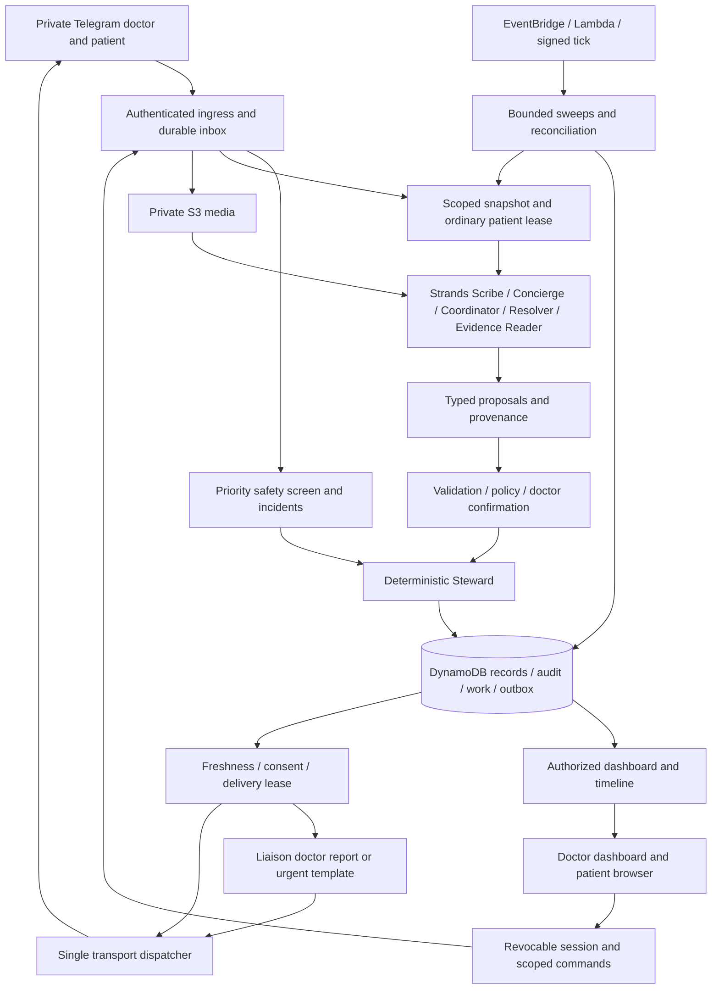

# Sanad Architecture

Version: 2.0 · Reconciled design for the final audit · 2026-09-05

This is the proposed full-product architecture, not implementation approval. No product code has been written. The hackathon is a delivery milestone and does not authorize removing required capabilities. [domain-model.md](domain-model.md) defines entities, states, clocks and store interfaces. [decisions.md](decisions.md) records product choices. Resolve contradictions before releasing a coding contract.

## System shape

Sanad carries the doctor's confirmed instructions between visits. Agents understand language and propose moves. The deterministic Steward owns identity, clinical boundaries, accepted facts, mission transitions, deadlines and message eligibility. The Liaison owns doctor-facing communication; direct requested answers are distinguished from proactive patient-status reports. A transport adapter alone holds sending credentials.

Patient output passes the Concierge or an approved template and its validator. Agents never send directly. DANGER rendering belongs to the Liaison's deterministic path and never waits for its model.

## Stack and deployment

Python 3.12, FastAPI, Pydantic, Strands Agents SDK, boto3, DynamoDB and private S3. Bedrock supplies reasoning/vision models from the Amazon Nova family (Decision 017); exact IDs and dependency versions are pinned after real access and compatibility checks. Amazon Transcribe and CPU faster-whisper are measured on Egyptian Arabic, mixed drug names and numbers before choosing the voice adapter. Amazon Location Service supplies place search with measured local coverage and a truthful no-result fallback.

One codebase and container image contain the HTTP application and bounded worker handlers. ECS Express Mode on Fargate in us-east-1 is the preferred, **unproven** host. The health/HTTPS/tick/cost spike must establish availability, sizing and deployment. Container-image Lambda is an evaluated hosting fallback, not an assumed compatible substitute. A host change does not delete a feature. New bot, AWS resources and identities isolate the frozen Google entry.

EventBridge invokes one tick Lambda every minute, calling authenticated worker routes. Work is persisted before an in-process invocation. A local task can reduce latency but is never the only executor. Worker calls have execution budgets, reclaim expired work and leave remaining pages due for another call. One minute is trigger cadence, not a maximum latency guarantee. Use separate deployment/task/tick permissions, SSM SecureString, TLS, private buckets and usage controls. Browsers never query DynamoDB directly. Uptime, restore, cost and clinical deployment are separate gates. Synthetic and eventual clinical environments are isolated.

## Clinical truth and edits

Versioned current DynamoDB aggregates are authoritative. Every accepted mutation atomically updates aggregates, appends immutable audit events and records owed work/messages. Keep these distinct:

- **Observation:** what arrived, verified source, receipt time and protected payload/media reference.
- **Candidate:** parser/model interpretation with raw/normalized values, spans/regions, uncertainty and validators.
- **ClinicalFact:** typed doctor statement, patient report, document observation or clinician-confirmed information. An accepted patient report remains a report.
- **CareOrder:** structured doctor-approved active instruction and immutable historical versions. Medication name, dose, unit, route, timing and prescribed effective dates are fields, not competing prose.
- **Mission:** finite objective attached to exact order versions, a completion predicate and clocks.
- **ReviewObligation:** independently timed work owned by the doctor; it survives fulfillment, cancellation, opt-out and unsuccessful disposal.

Unknown allergies are not “no allergies.” Old prescriptions do not replace active medications. Confirmed order revisions replace current heads while preserving history. Every candidate and intent carries the versions used. A correction names the exact accepted version it supersedes, invalidates dependent fulfillment if necessary and creates timed review. It never restarts contact or a prescription implicitly. Late new uploads are retained and screened, then explicitly associated or offered as a new mission; they are not corrections by implication.

## Identity and channels

### Doctor approval and dashboard

Only private Bot API messages establish a clinical Telegram identity. Verify transport secret, private chat type and numeric sender user ID; never trust usernames, claimed roles or group chat IDs. A stranger may apply. Configured admin identity approves/rejects with actor and timestamp. Enrollment powers do not grant unrestricted patient-content access.

An approved doctor receives a random, hashed, ten-minute, single-use login exchange in the verified chat. GET `/d/<token>` displays a neutral Continue page; only a same-origin CSRF-protected POST consumes it and creates a rotated HttpOnly/Secure/SameSite session. Redirect to a clean URL. Redact exchange routes in platform/application logs, set no-referrer/no-store and load no third-party assets. A preview GET cannot consume the token.

Every API, page, callback and media fetch rechecks role, approval, auth epoch and ownership. Mutations also check CSRF, expected version and command ID. Suspension increments auth epoch, revokes exchanges/sessions, invalidates unsent routine contact and creates coverage review. It never transfers patients automatically.

### Patient QR, consent and claim proof

An invitation contains only an opaque random token, stored hashed, scoped to one doctor/patient, expiring by policy and revocable on reissue. No patient name, diagnosis or medication is encoded. Opening it reveals the doctor/service identity and neutral claim instructions only. It does not reveal records or immediately bind a chat.

The intended patient identifies their account in private Telegram, provides a minimal claim identifier and accepts consent/contact preferences. The doctor then confirms through the encounter or an established contact process that this account is the intended patient. QR possession alone is not proof. Persist a pending claim; a second scan cannot overwrite its claimant. The doctor may reject/reset a wrong claim by revoking the invitation.

Final consumption, approved claim, patient binding and globally unique bot-subject mapping are one transaction. A bot identity may have explicitly authorized admin and doctor roles together. A patient role/binding is exclusive of clinician/admin roles and has one immutable doctor owner. Reject replay, expiry and conflicting bindings without disclosing another record. Claims have review deadlines, so an unscanned QR cannot hide overdue care. Caregiver access and reassignment require a separately approved workflow.

The patient browser uses its own short-lived POST exchange delivered to the verified Telegram account, bound to the active PatientBinding and consent version. An ordinary web request cannot prove a Telegram identity. A browser-first claim remains pending without clinical disclosure until the same consent/doctor-proof gate completes. Revocable patient sessions expose only the released plan and exchanged data, never private doctor notes. Binding recovery freezes disclosure/contact until explicit identity resolution.

## Durable ingress and recovery

1. Authenticate transport and derive scope. Persist an `InboundReceipt` with the permitted normalized payload or immutable protected reference, source media handle, receipt time and processing state before returning 200. Store failure must not be acknowledged as saved.
2. A receipt starts `pending` with `next_action_at`. Duplicates locate it: a completed duplicate does nothing; an unfinished duplicate preserves/resumes existing processing. Existence never means completion.
3. A worker takes an expiring processing claim with increasing generation. Completing work atomically commits domain effects and marks the receipt completed. Crashes/timeouts leave reclaimable work; the inbound sweep retries expired claims. Exhaustion becomes `needs_attention` with timed review/operational ownership, never an invisible dead letter.
4. `MediaWork` separately persists retrieval, protected provider handle, private S3 source and extraction state. Expired downloads ask for resend and remain owned. Never log token-bearing provider file URLs.
5. A `PhotoReceipt` deduplicates bytes only within patient scope and points to media/evidence processing. An incomplete duplicate joins pending work, never pretends that processing succeeded. Each new caption is still screened. Explicit reuse may reference old evidence without claiming newly collected data.
6. Bounded paginated sweeps cover inbound/media, expired claims, missions, FollowUpTasks, ReviewObligations, doctor bundles and outbox. Re-read authoritative state and due time after an eventually consistent index result.

Safe size/duration/type limits bound permitted inputs. Safety sees all permitted text and captions before conversational caps. Unsupported/oversized/unreadable media gets a truthful resend route and timed unresolved work; the system cannot claim to detect an emergency hidden in unprocessed media.

## Ordinary turns and urgent incidents

All ordinary patient workers (replies, doctor changes, association, ticks and resumed sessions) share a per-patient lease and increasing fence generation. Read a versioned scoped snapshot. Model/network work occurs outside transactions. Commit rechecks owner/expiry/fence, safety/delivery epochs, doctor auth epoch, consent, mission/order heads and command authority. A stale worker cannot write over its replacement.

A doctor's new-patient dictation/photo initially belongs to a doctor-scoped IntakeDraft with its own fence; no patient ID or patient consent is fabricated to store that input. Confirmation creates the patient or acquires the chosen existing patient's fence, then atomically associates the accepted material. Unassigned intake is visible only to its owning doctor and has a review clock.

Strands session writes are buffered and committed under the same fence, or enforced by a repository adapter on every write. Unguarded SDK callbacks cannot mutate memory after a lost lease. Instantiate fresh Agent objects per invocation from the scoped persisted session; never share a mutable Agent across concurrent requests.

Unassigned doctor intake uses a doctor-private IntakeConcern and ReviewObligation tied to IntakeDraft, with its own safety_epoch and source dedupe. Danger found before patient association is shown to the submitting doctor through the Liaison gateway without inventing a patient identity or contacting a patient. It bypasses the ordinary intake lease. Doctor-confirmed association explicitly links the concern to the chosen record, creates any necessary patient incident/guidance, and records prior delivery so the same facts do not produce unexplained duplicate alerts. Unresolved unassociated concerns keep independent review clocks.

The urgent path explicitly bypasses the ordinary lease. It screens available text, records an incident with a unique source/rule-family key, increments patient `safety_epoch` and atomically creates review and urgent intents. It does not edit ordinary session/mission state or wait behind transcription. The old safety epoch then prevents conflicting reassurance from committing/sending. Reprocessing the same source deduplicates; later independent dangerous observations are not suppressed by a permanent patient flag.

Approved deterministic patient safety guidance is delivered independently of the doctor's transport/acknowledgment. Doctor alert delivery uses the Liaison. Later verified status may say Telegram accepted the alert, never that the doctor read it or guarantees monitoring. Clinical policy owns severity/applicability; agents cannot invent either.

## Doctor dictation and patient support

The Scribe accepts text, voice transcription and prescription/history/medication photos. For prescription photos the Evidence Reader independently extracts the same fields; the Steward compares the two candidates and marks disagreements uncertain on the card, where every field stays editable (Decision 018). Code handles explicit commands, then typed proposals for search/create/update/missions. Reads are doctor-scoped; ambiguous patient matches ask. A confirmation shows patient identity, old/new fields, active order changes, objectives, predicates and exact deadlines with reasons. It references base versions, expiry and a one-use nonce.

Missing deadlines are inferred from task-specific approved defaults and contextual proposals, shown on the existing confirmation card. An explicit valid time survives exactly, including hours. The reconciled default notification grace is **zero**; only an explicit visible doctor policy adds grace, showing `escalation_at = due_at + grace`. Inference cannot invent drug, dose, treatment duration, preparation or other absent clinical content. Necessary ambiguity asks; independent valid items can be confirmed separately. Incomplete drafts and awaiting-link care retain review times without authority to send incomplete treatment instructions.

Patient handling runs deterministic safety, bounded add-only safety voting, treatment-change gate and code intents before Concierge. Concierge explains the active plan, gives bounded general education from the scoped reviewed sources, asks clarification or creates a QUESTION support ticket. Every generated patient sentence passes output validation and bounded reassurance checks; failure yields a safe template/relay. Education is required with a small owned source/evaluation set, not an unwritten prerequisite library.

Contract 10 implementation boundary: patient-initiated replies require the active clinical consent and binding, including when routine contact is stopped or snoozed. Routine permission and pause expiry are separate operational fields; preference transactions keep Patient, Consent, PatientBinding and PatientProfile versions coherent and increment delivery_epoch. A scoped patient-turn transaction commits reports/preferences/questions, audit, validated reply and receipt completion together. START reports use the existing objective transition and independently anchor the existing day-three task; raw ordinary replies keep their existing non-fulfilling meaning. Concierge session snapshots contain only the last six accepted conversation messages and remain disposable, fenced memory.

Education is a versioned set of bounded excerpts. Clinical entries cite fetched public health sources; the emergency entry takes its actionable wording exclusively from the safety policy. Product-specific QR and photo instructions cite their local Sanad specification separately from the public NHS background source, so no public body is credited with describing Sanad. Pending translations are synthetic-only. Model-selected sentences must match the bundle's permitted plan or education sentences, in addition to the existing clinical, language, numeric, source and length gates; the model cannot invent a new drug-number association.

Coordinator chooses guarded mission proposals. Resolver addresses practical barriers within a question/search budget. They can propose contact times or verified places, but cannot change clinical deadlines, book without an authorized integration, invent availability/prices or prescribe substitutes. Provider failure uses the deterministic ladder with visible failure state. Both remain required capabilities.

## Fulfillment, evidence and clocks

Mission execution and clinical review are separate. `fulfilled` means the explicit objective predicate is met; `DONE` is a message class, not clinical clearance or a state name. Old `pending_review` becomes a derived review status of fulfilled work. Unsuccessful disposal is `closed_unfulfilled`, never fulfillment. See the exact [state/event contract](domain-model.md#mission-state-and-event-contract).

TEST checks identity, ordered analytes, units and collection window; permitted partial reports may jointly satisfy coverage. Ambiguous identity/units remain candidates. Every route, including mismatched/unexpected documents, evaluates supported danger rules and can create an unverified incident without accepting data onto the wrong record. SEND_RECORDS defines categories, historical period and count/completeness: old dates are valid, unrelated readable files are not. It never silently fulfills a new TEST. MONITOR assigns readings to explicit slots and preserves missing/duplicate/late distinctions and threshold hits. Receipt/collection and extraction times differ. Domain-model defines objective_received_at and timeliness separately from fulfilled_at. Pending extraction at the deadline is reported as verification pending, not a fabricated patient-late submission; receipt alone still cannot prove completeness.

Doctor confirmation of a START instruction creates an independent `MEDICATION_DAY3` FollowUpTask immediately, awaiting its effective-start anchor if unknown. Medication START acknowledgment fulfills only the start-report objective, labeled patient report, and anchors/preserves that existing follow-up. An explicit doctor date can anchor it at confirmation. STOP/CHANGE acknowledgments do not automatically create a new day-three task; a doctor-requested follow-up uses an explicit CLINICAL_CHECKIN. Plan confirmation is never proof the patient started. Unknown anchors remain timed clarification work; once known, the independent task remains scheduled after START fulfillment. Its question, response, silence, red flags and deadline are persisted separately. A valid answer to the check-in fulfills the FollowUpTask and produces its own DONE notice, so a START order yields two DONE notices, one at the start report and one at the answered day-three check-in (Decision 012). STOP/CHANGE orders have their own exact predicates. Recurring dose reminders are owner-agreed later scope; full v1 includes start acknowledgment and day-three follow-up. Opt-out/order stop suppresses routine contact but retains timed disposition of unfinished follow-up.

Every mission stores due time/provenance, visible grace, review time and next action; pauses also have resume time. ReviewObligations and FollowUpTasks have independent clocks. A doctor BundleSchedule owns weekly reminders. Fulfillment/cancellation clears only mission execution wakes, never these independent clocks.

Tick processes accountability before contact eligibility: unmet deadlines, unlinked patients, review, incidents and bundles survive contact pause/stop. Three budgets distinguish daily patient-wide chase, consented scheduled monitoring/check-in slots and urgent messaging. Scheduled slots preserve clinical timing and require explicit quiet-hour exceptions. Never shift a prescription or burst stale reminders after an outage.

## Doctor communication and review

Steward classifies DANGER, DONE and DEADLINE according to recorded policy. Liaison composes from a versioned facts bundle, with templates if its model is down. All doctor interactions share that presentation owner; requested registration/lookup/confirmation replies remain outside the proactive filter.

DANGER is immediate. A critical observation that also fulfills a task produces one urgent report carrying both facts, not redundant DONE. DONE announces verified/report-qualified fulfillment of a mission or a FollowUpTask before clinical review. DEADLINE carries unmet deadlines, due support/review or the approved pre-visit subtype. Routine progress/barriers remain on the dashboard unless requested.

The reconciled correction proposal is an updated-DONE report referencing an already delivered report and its explicitly accepted correcting version. It states that the prior report changed, including invalidated fulfillment, and requests review; it never pretends the objective was fulfilled again. A qualifying danger uses DANGER instead. This subtype is a design proposal for final audit, not evidence of new owner approval.

Each incident/evidence version/disposition has one active ReviewObligation per kind, deduplicated by source key. States are `open | acknowledged | resolved`; “seen” is not resolution. Review/Answer/Extend/Close/Cancel resolves only obligations whose conditions that action satisfies. Cancelling a mission does not dismiss a dangerous result. Review survives terminal execution, opt-out and failed delivery.

After an initial DEADLINE notice, unresolved cards enter one doctor-wide bundle after seven days and weekly thereafter; no daily per-item nagging. Material changes supply a versioned new notification reason. Incident coverage has its own urgent policy; a weekly ordinary bundle cannot replace urgent response. Suspended coverage creates operational review without automatically disclosing clinical content to an unapproved admin.

## Outbox and delivery

A domain commit includes audit, next-work state and outbound intents in one DynamoDB transaction. Sending is outside it. Each intent's logical key uses source event/version, audience, purpose and slot; attempt numbers belong to DeliveryAttempt, not that logical key.

Before sending, a dispatcher claims an expiring delivery lease and checks the applicable account/intake/patient audience variant in domain-model: current recipient authority, source versions, expiry and relevant epochs/orders. Patient routine messages require current binding/consent; valid doctor accountability does not depend on the patient remaining opted in or linked. Intake alerts require doctor/intake authority, not an invented patient binding. Eligibility is purpose-specific: DONE:FULFILLMENT requires currently valid fulfillment; proposed DONE:CORRECTION requires a previously delivered report plus its current accepted correcting version and may send while fulfillment is invalidated_pending_review. It explicitly corrects the earlier conclusion and never announces new completion. Other current authority checks still apply. Invalid routine intents become `suppressed` with reasons, including old queued output. Chase reservation is atomic; refund only a provably unsent attempt, never an uncertain one.

Delivery states are `queued → sending → provider_accepted | uncertain | failed`, plus `suppressed`. Acceptance stores Telegram message ID. Doctor acknowledgment is a separate review/card event. Retryable failure retains bounded attempts/retry time; permanent blocked-chat errors create disposition work. Uncertain DANGER may be resent once, labeled the same incident. Ordinary uncertain delivery waits for timed review. Neither is assumed successful.

A dispatch-start transaction revalidates freshness and records a network attempt. An edit/opt-out invalidates unsent intents but cannot recall an already-started external request. Record the race. If an old instruction may have reached the patient, send the new doctor-approved correction through the patient channel and create timed review. Never promise exactly-once delivery or instantaneous recall across a network boundary.

## Interfaces and implementation boundaries

Commands include ApproveDoctor, SuspendDoctor, ConfirmPatientClaim, ConfirmProposal, ReviseOrder, RecordEvidence, CorrectEvidence, ExtendMission, ReopenMission, CancelMission, CloseUnfulfilledMission, AcknowledgeReview, ResolveReview and SetContactPreference. Each carries Principal, idempotency key, expected versions and typed payload. Return accepted, stale, forbidden, unsupported or needs-confirmation explicitly.

HTTP families: POST `/tg`; authenticated `/internal/tick`, work and delivery; GET/POST doctor/patient exchanges; `/d`, `/p`, `/a`; scoped `/api/*` and media; `/health`. Internal calls validate service identity/HMAC, timestamp and persisted nonce replay protection. Browser writes use session+CSRF. Telegram callbacks are opaque references with actor/version/expiry checks.

Strands uses a BedrockModel factory, fresh Agents, structured outputs, scoped @tool functions, BeforeToolCallEvent cancellation plus in-body guards, fenced RepositorySessionManager, bounded async calls and metadata-only traces. Agents propose; Steward commits. Tools cannot select tenants, obtain secrets, call arbitrary URLs or change policy. The spike verifies actual SDK behavior before it is claimed.

Failures preserve input and owed work. Database outages cannot receive a saved ACK; model/schema failures cannot change clinical truth; unreadable media stays timed; conflicts re-read. Every unresolved item has an owner, action and time. Reconciliation repairs missing derived work without manufacturing success.

Contracts 00–21 deliver the full product: typed foundation; state/deadlines; store/recovery; safety/identity/deployment/Strands; complete care flow; corrections; integration and operational/pilot readiness. Contract 22 packages the contest entry. No product code starts before the final audit and release of a bounded contract.

A patient start report received after routine contact is stopped still records the report and the independent day-three anchor. The follow-up remains contact-suppressed, with its disposition review intact; anchoring does not renew contact consent. Start replies show the stored check-in time or acknowledge that reminders remain stopped. Ambiguous reported start dates require clarification before fulfillment.

The shared proposal adapter uses answer-specific request framing for Concierge; extraction framing remains with extractor roles. The Concierge selects relevant permitted sentences for the current question, and conversation never authorizes repeated or unsupported patient guidance.
